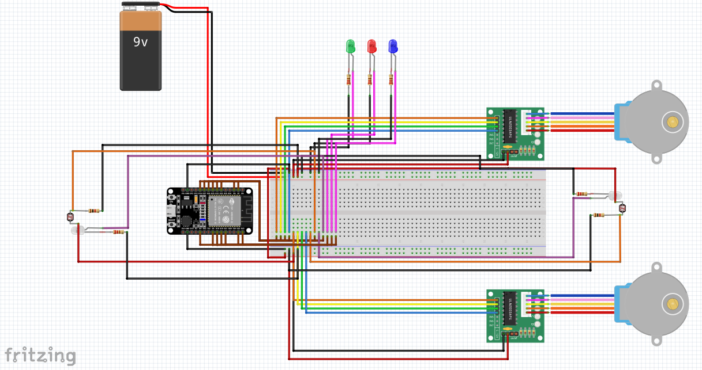

# Robô Sumô - Controlável
``` 
🛠️ Projeto em desenvolvimento...
``` 

### Protoboard


<!-- ## Experiências Práticas -->


## 🔨 Requisitos
Desenvolver um Robô de competição Sumô que será controlado pelo ESP32 DEVKIT v1 - DOIT via WI-FI. 

- [x]  Criar esquemático  do projeto
- [ ]  Criar código em C
    - [ ]  Rotear WIFI ESP32 (usuário e senha)
    - [ ]  Criar servidor HTTP
        - [ ]  Criar página web para envio de comandos
        - [ ]  Mapear as rotas para o recebimento dos comandos
            - [ ]  Criar comandos
                - [ ]  Ir para frente
                - [ ]  Ir para trás
                - [ ]  Ir para a esquerda
                - [ ]  Ir para a direita
                - [ ]  Diagonal direita frente
                - [ ]  Diagonal direita trás
                - [ ]  Diagonal esquerda frente
                - [ ]  Diagonal esquerda trás
    - [ ]  Criar lógica para evitar a cor clara
        - [ ]  Configurar o código para os LDR’s
- [ ]  Instalar o código no ESP32
- [ ]  Desenvolver os aspectos físicos do Robô (roda, chassi e rampa)
- [ ]  Montar robô