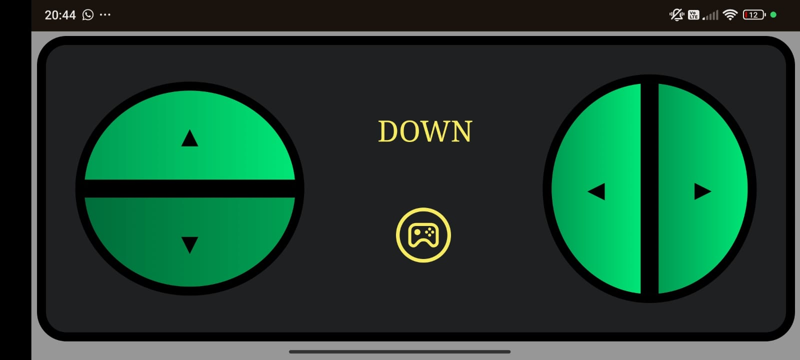

# Robô Sumô - Controlável
``` 
🛠️ Projeto em desenvolvimento...
``` 

### Protoboard


### Controle



## 🔨 Requisitos
Desenvolver um Robô de competição Sumô que será controlado pelo ESP32 DEVKIT v1 - DOIT via WI-FI. 

- [x]  Criar esquemático  do projeto
- [x]  Criar código em C
    - [x]  Rotear WIFI ESP32 (usuário e senha)
    - [x]  Criar servidor HTTP
        - [x]  Criar página web para envio de comandos
        - [x]  Mapear as rotas para o recebimento dos comandos
            - [x]  Criar comandos
                - [x]  Ir para frente
                - [x]  Ir para trás
                - [x]  Ir para a esquerda
                - [x]  Ir para a direita
    - [ ]  Criar lógica para evitar a cor clara
        - [ ]  Configurar o código para os LDR’s
- [x]  Instalar o código no ESP32
- [x]  Desenvolver os aspectos físicos do Robô (roda, chassi e rampa)
- [ ]  Montar robô